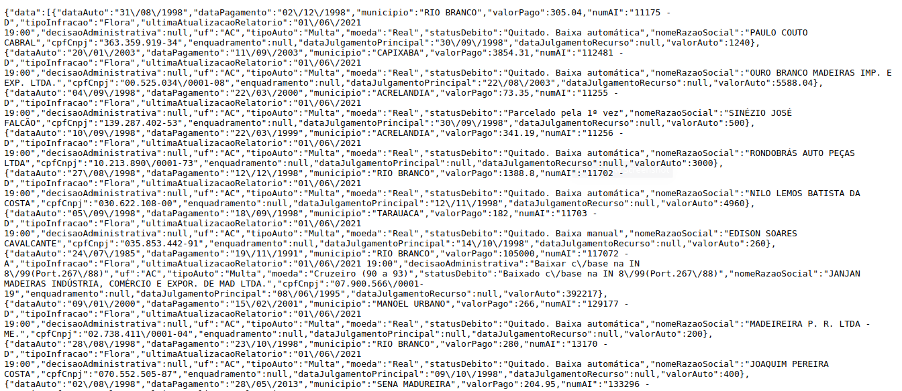

# Documentação | bot-ibama Julgamentos Auto de Infração

<br/>

## 1. Introdução

O bot ibama foi desenvolvido para coletar dados disponíveis  de julgamentos de Auto de Infração - realizado no âmbito do IBAMA: https://dados.gov.br/dataset/volume-de-julgamento-de-auto-de-infracao

Os dados são fornecidos através de um endereço base variando-se a unidade da federação desejada:

* URL: 'http://dadosabertos.ibama.gov.br/dados/SICAFI/AC/Volume/volumeJulgamentoAI.json'

Neste caso, O endereço retorna os dados do Acre (AC) em formato de dicionário, então são coletados e armazenados em arquivo JSON.

<br/>

Exemplo dos dados disponiveis na URL mencionada:


<br/>

## 2. Resultado do bot (Outputs)

O bot irá gerar dois arquivos no final da execução.

* _ibama_jai.json: contém os dados dos julgamentos dos autos de infração disponibilizados via API. Se trata de um dicionário de dados.

```json
{
    "data": [
        {
            "dataAuto": "31/08/1998",
            "dataPagamento": "02/12/1998",
            "municipio": "RIO BRANCO",
            "valorPago": 305.04,
            "numAI": "11175 - D",
            "tipoInfracao": "Flora",
            "ultimaAtualizacaoRelatorio": "01/06/2021 19:00",
            "decisaoAdministrativa": null,
            "uf": "AC",
            "tipoAuto": "Multa",
            "moeda": "Real",
            "statusDebito": "Quitado. Baixa automática",
            "nomeRazaoSocial": "PAULO COUTO CABRAL",
            "cpfCnpj": "363.359.919-34",
            "enquadramento": null,
            "dataJulgamentoPrincipal": "30/09/1998",
            "dataJulgamentoRecurso": null,
            "valorAuto": 1240
        }
    ]
}
```

* ibama_jai.log: contém informações de log e tempo de execução do bot.
Obs.: O arquivo contém uma "string" padrão no nome, com data e hora de execução.

```log
2021-06-02 10:02:22,405 - INFO - Conectado com sucesso no Bucket: bvs-bigdata-datalake-stage-external-cadastral-rf-dev
2021-06-02 10:02:31,958 - INFO - Download finalizado. URL: http://dadosabertos.ibama.gov.br/dados/SICAFI/AC/Volume/volumeJulgamentoAI.json: 
2021-06-02 10:02:32,613 - INFO - Arquivo salvo no BUCKET: <Bucket: bvs-bigdata-datalake-stage-external-cadastral-rf-dev> e BLOB: <_io.TextIOWrapper encoding='UTF-8'>
2021-06-02 10:02:34,650 - INFO - Aplicação finalizada. Tempo de execução: 13.453940391540527s
```

<br/>

## 3. Funcionalidades

* O bot acessa a URL base com a lista de estados desejada, para capturar os dados através de um comando GET na API.
* O bot utiliza-se de multiprocessamento para abrir requisições de dados em simultâneadade e consolida-lo em um único dicionário
* Valida a conexão com o bucket e projeto no GCP, em seguida cria o blob para o a sequência do trabalho.
* Realiza a leitura dos dados capturados e transfoma em texto.
* Aciona a função de upload para o GCP, que irá armazenar os dados em um arquivo JSON.
* Armazena o log de processamento/execução do bot, no mesmo bucket e blob do arquivo JSON

<br/>

## 4. Conteúdo

O bot é composto por quatro arquivos:

* bot_ibama.py: programação python para download e upload de dados.
* gcp_connect.py: programação python para fornecer conexão com o GCP.
* bot_config.py: programação python para fornecer os parametros e as configurações do bot.
    * GCP project, Bucket and Blob;
    * Nome dos arquivos;
    * Parametros de requisição.
* Dockerfile: script Docker para construir o container da aplicação.